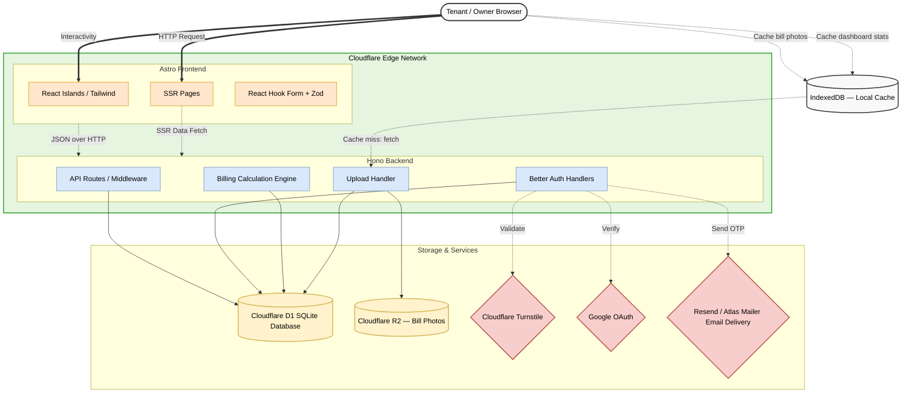
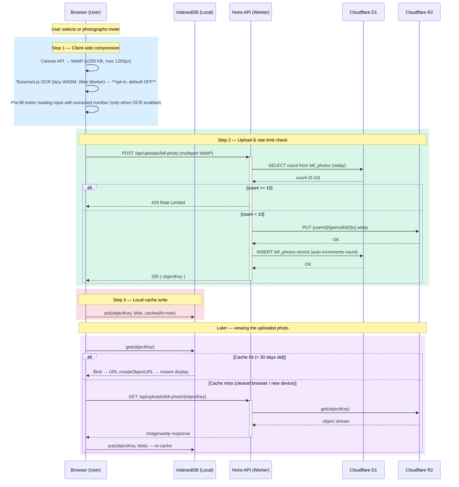
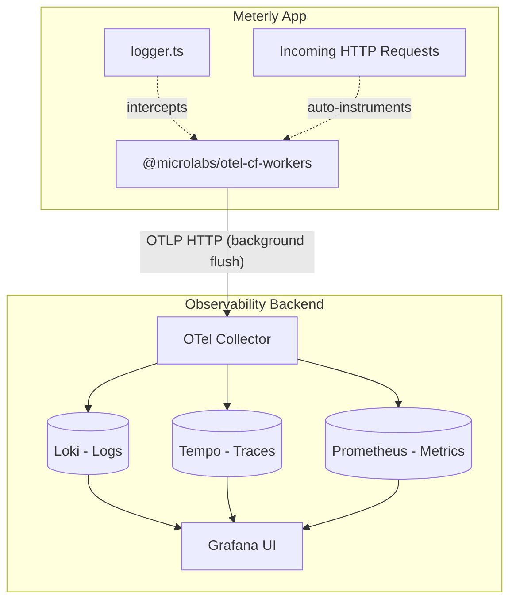

<p align="center">
  
</p>

<h1 align="center">Meterly</h1>

<p align="center">
  
  
  
  
  
</p>

Meterly is a transparent, multi-tenant utility billing platform designed to eliminate disputes between property owners and tenants. It specializes in handling complex utility scenarios, specifically properties equipped with grid-tied solar installations.

## Overview

Traditional sub-metering often leads to friction due to opaque calculations. Meterly solves this by providing absolute mathematical transparency. When an owner generates a bill, tenants can view the exact formula used to calculate their share, including consumption rates, solar export refunds, and custom property charges.

## Key Features

- **Dual-Mode Billing Engine:** Supports both standard grid-only properties and complex solar-equipped properties with export tracking.
- **Absolute Transparency:** Tenants see the exact breakdown of their bill, down to the last unit and applied rate.
- **Audit Trails & Dispute Resolution:** Built-in workflow for tenants to request edits on meter readings. Owner approvals trigger an automated recalculation cascade.
- **Solo Mode:** Owners without tenants can track their own electricity bills using the same engine.
- **Tenant Lifecycle Management:** Invite, remove, and re-add tenants. Past tenants retain read access to their historical bills permanently.
- **AI-Native Architecture:** Codebase organized using the DOX framework, navigable by autonomous AI agents.

## Session Management

Meterly limits concurrent sessions per user to prevent token accumulation and enhance security.
- **Max sessions per user:** 3 (configurable via `MAX_SESSIONS_PER_USER`)
- **Cleanup strategy:** FIFO (First In, First Out)
- **When triggered:** On every login
When a user logs in from a 4th device, the oldest active session is automatically deleted.

## Tech Stack

- **Frontend:** Astro (Islands architecture), React, Tailwind CSS, shadcn/ui, Recharts
- **Backend:** Hono, Drizzle ORM
- **Database:** Cloudflare D1 (SQLite)
- **Authentication:** Better Auth (Email + Password, Google OAuth, Email OTP for verification/reset)
- **Bot Protection:** Cloudflare Turnstile on auth routes
- **Deployment:** Cloudflare Pages & Workers

### Architecture



## API Documentation

Meterly's API is documented with OpenAPI 3.0 via `@hono/zod-openapi`.

- **Swagger UI:** Available at `/api/docs` (development and production)
- **Raw spec:** Available at `/api/docs/openapi.json`

In local development: http://localhost:4321/api/docs

The spec is generated from code — every route registered with `createRoute()` appears automatically. No separate JSON file to maintain.

### Bill Photo Upload Architecture

The upload flow keeps R2 costs minimal and gives users instant local access via IndexedDB.



**Key design decisions:**
- Compression happens entirely in the browser — zero server CPU cost.
- OCR (Tesseract.js) runs in a Web Worker so it never blocks the UI thread. It is **opt-in and off by default** — users toggle it per upload. This avoids the 2–5 second WASM load for users who just want to store a photo.
- R2 object keys are prefixed with `{userId}/` — the API enforces this prefix on every read, so cross-user access returns 403.
- On property delete, the API purges all R2 objects under `{userId}/{periodId}/` via `waitUntil` (non-blocking).
- Upload rate-limiting queries existing database records from D1 daily (start of UTC day), avoiding the Cloudflare KV write limit bottleneck entirely.

## Project Structure (DOX Framework)

This project strictly adheres to the DOX framework. Each domain directory contains an `AGENTS.md` file that acts as a binding contract defining the folder's purpose, ownership, and architectural rules.

- `/src/api` — Hono backend routing and pure billing logic
- `/src/components` — React interactive islands organized by domain (`auth`, `dashboard`, `properties`, `ui`)
- `/src/db` — Drizzle ORM schemas and queries
- `/src/layouts` — Astro server-rendered layouts
- `/src/pages` — Astro server-rendered pages and API routing catch-alls

## Getting Started

### Prerequisites

- Node.js (v18+)
- pnpm (v10+)
- Cloudflare account (free tier works)
- Cloudflare Wrangler CLI

### Quick Start

1. **Clone and Install**
   ```bash
   git clone https://github.com/VaibhavDaveDev/Meterly.git
   cd Meterly
   pnpm install
   ```

2. **Set Up Environment Variables**
   
   Copy `.env.example` to `.dev.vars`:
   ```bash
   cp .env.example .dev.vars
   ```

   **For local development**, the default test values work out of the box:
   - `BETTER_AUTH_SECRET`: Pre-filled with a dev secret (change in production!)
   - `BETTER_AUTH_URL` and `PUBLIC_BETTER_AUTH_URL`: Set to `http://localhost:4321`
   - `PUBLIC_TURNSTILE_SITE_KEY` and `TURNSTILE_SECRET_KEY`: Cloudflare's always-pass test keys
   - OAuth and mailer: Optional for local dev (email/password auth works without them)

3. **Create Cloudflare Resources**

    You need to create a D1 database and update `wrangler.jsonc`:

    ```bash
    # Create D1 database
    pnpm exec wrangler d1 create meterly-db
    # Copy the 'database_id' from the output
    ```

    Open `wrangler.jsonc` and replace the placeholder D1 ID:
    ```jsonc
    {
      "d1_databases": [{
        "database_id": "paste-your-d1-id-here"  // ← Replace this
      }]
    }
    ```

4. **Initialize Database Schema**

   **Important:** Apply the schema to your **local** D1 database:
   
   ```bash
   pnpm exec wrangler d1 execute meterly-db --local --file=./src/db/migrations/0000_init.sql
   ```

   This creates all tables (users, properties, bills, etc.) in your local SQLite database.

5. **Start Development Server**
   ```bash
   pnpm run dev
   ```

   The app will be running at `http://localhost:4321`

6. **Test the App**
   - Visit `http://localhost:4321/signup`
   - Sign up with any email and password
   - The 6-digit OTP verification code will be printed in your terminal
   - Copy the code and verify your email
   - You're in! Create a property and start billing.

7. **(Optional) Seed demo data**

   To get a fully populated dashboard without manual setup, reset the local database and load realistic demo fixtures:

   ```bash
   pnpm seed:fresh
   ```

   This deletes any existing local data, re-applies the schema, and inserts:
   - 1 property ("Sunshine Residency") with solar enabled
   - 6 months of billing periods (Jan–Jun 2026) with meter readings and bills
   - 2 demo accounts:

   | Role | Email | Password |
   |------|-------|----------|
   | Owner | `owner@demo.meterly.app` | `DemoOwner123` |
   | Tenant | `tenant@demo.meterly.app` | `DemoTenant123` |

   To reseed without deleting `.wrangler/` entirely:
   ```bash
   pnpm seed
   ```

   > Never commit real credentials or user data to `scripts/seed.ts`.

### Common Issues

**Q: Turnstile widget not showing?**  
A: Check that `PUBLIC_TURNSTILE_SITE_KEY="1x00000000000000000000AA"` is uncommented in `.dev.vars`. If you want dev mode without Turnstile (faster), comment it out — forms will still work.

**Q: Database errors or "table does not exist"?**  
A: Make sure you ran the migration with the `--local` flag and that your `database_id` in `wrangler.jsonc` matches the one from `wrangler d1 create`:
```bash
pnpm exec wrangler d1 execute meterly-db --local --file=./src/db/migrations/0000_init.sql
```

**Q: Email OTP not arriving?**  
A: In development mode, OTPs are **printed to your terminal/console**. Check the logs where you ran `pnpm run dev`. You don't need a working mailer for local dev.

---

## How D1 Database Works in Local Dev

Meterly uses **Cloudflare D1** (SQLite) as its database. Here's how it works in local development:

### Local D1 Mocking

When you run `pnpm run dev`, **Wrangler automatically creates a local SQLite database** in the `.wrangler/state/v3/d1` directory. This is a real SQLite database file that persists between dev server restarts.

**Key points:**
- **No separate setup needed** — Wrangler handles it automatically
- **Database location:** `.wrangler/state/v3/d1/miniflare-D1DatabaseObject/`
- **Persistence:** Data survives dev server restarts (unless you delete `.wrangler/`)
- **Migrations:** You must manually apply schema changes using `wrangler d1 execute --local`

### Local vs Remote D1

| Aspect | Local (`--local` flag) | Remote (production) |
|--------|----------------------|---------------------|
| **Database** | SQLite file in `.wrangler/` | Cloudflare's distributed D1 |
| **Data persistence** | Survives restarts | Permanent |
| **Apply migrations** | `wrangler d1 execute --local` | `wrangler d1 execute --remote` |
| **When to use** | Development & testing | Production deployment |

### Why You See `preview_database_id: "local"` in wrangler.jsonc

This tells Wrangler to use the local SQLite file instead of hitting the remote D1 database during development. This is **intentional** and saves you from needing separate dev/prod databases.

---

## How R2 Storage Works in Local Dev

Meterly uses **Cloudflare R2** for storing meter bill photos.

When you run `pnpm run dev`, **Wrangler automatically creates a local R2 bucket** in the `.wrangler/state/v3/r2` directory. You do not need to create a real bucket on Cloudflare for local development.

**Key points:**
- **No separate setup needed** — Wrangler handles it automatically via the `r2_buckets` configuration in `wrangler.jsonc`.
- **Database location:** `.wrangler/state/v3/r2/`
- **Persistence:** Files survive dev server restarts (unless you delete `.wrangler/`).
- **Production:** For production, you will need to create the real bucket using `pnpm exec wrangler r2 bucket create meterly-bills`.

---

## Database Migrations
### What Are Migrations?

Migrations are **version-controlled SQL files** that describe every change made to the database schema over time. Meterly has a single squashed baseline:

- `0000_init.sql` — The complete starting schema (all tables, indexes, and constraints in one file).

Every change you make to `src/db/schema/` after this point becomes a new numbered migration file, starting from `0001`. These files live alongside your code in Git, which means the database history is auditable, reversible, and reproducible across environments.

### Why Use Migrations Instead of `drizzle-kit push`?

| Approach | Migrations (Recommended) | Direct Push (Avoid) |
|----------|--------------------------|---------------------|
| **Version control** | Every change is tracked in Git | No history — impossible to audit |
| **Rollback** | Revert by reversing the migration | Very difficult — manual SQL required |
| **Team collaboration** | Everyone sees exactly what changed | Silent divergence between environments |
| **Production safety** | Review SQL before applying | Can break production mid-push |
| **Multi-environment** | Apply same file to dev and prod | Hard to keep environments consistent |

### When to Create a New Migration

Any time you edit a file inside `src/db/schema/`, you need a migration. The workflow is:

```bash
# 1. Edit your schema file (add a column, add a table, add an index)

# 2. Generate the migration SQL — Drizzle diffs your schema against the last snapshot
pnpm exec drizzle-kit generate
# A new file appears: src/db/migrations/0001_describe_change.sql

# 3. Apply it to your local database and verify the app works
pnpm exec wrangler d1 execute meterly-db --local --file=./src/db/migrations/0001_describe_change.sql
pnpm run dev

# 4. When you deploy, apply to production before pushing new code
pnpm exec wrangler d1 execute meterly-db --remote --file=./src/db/migrations/0001_describe_change.sql
pnpm run deploy
```

**The rule:** migrations go to production *before* the code that depends on them. Never the other way around.

### Never Edit an Applied Migration

Once a migration file has been applied to any environment (local or remote), treat it as immutable. If you made a mistake, create a new migration to fix it — do not edit the existing file. Editing applied migrations breaks the diff chain that Drizzle uses to generate future migrations correctly.

### Can You Use `drizzle-kit push` Instead?

Yes, but you should not:
1. No audit trail — you will not know what changed or when
2. No rollback — `push` is destructive and unrecoverable
3. Dangerous in production — a failed push leaves the database in an inconsistent state
4. Team collaboration breaks down — other developers cannot reproduce what you did

Think of migrations as Git commits for your database.

---

## Development Notes

### Email OTP in Development

Meterly uses email OTPs for sign-up verification and password reset.

**In development, OTPs are always printed to the terminal:**

```
┌────────────────────────────────────────────────────┐
│ [DEV] OTP — EMAIL VERIFICATION
│ Email: you@example.com
│ Code:  483920
│ (This is only visible in dev — not in production)
└────────────────────────────────────────────────────┘
```

**Three dev-mode behaviors depending on your `.dev.vars` configuration:**

| Configuration | Behavior |
|---|---|
| No `EMAIL_PROVIDER` set | OTP prints to terminal only. No network call. Zero setup needed. |
| `EMAIL_PROVIDER=resend` + `RESEND_API_KEY` set | OTP prints to terminal **and** a test email is sent to `delivered@resend.dev`. Check the [Resend dashboard](https://resend.com/emails) to preview the template. |
| `EMAIL_PROVIDER=atlas` + `ATLAS_MAILER_URL` set | OTP prints to terminal **and** a real email is sent via [Atlas Mailer](https://github.com/VaibhavDaveDev/atlas-mailer.git). |

**Recommended for first-time setup:** Leave `EMAIL_PROVIDER` unset. Just use the terminal OTP.

**To test the full email template** in dev: Set `EMAIL_PROVIDER=resend` and your dev `RESEND_API_KEY`.
The email is redirected to Resend's `delivered@resend.dev` test address — no domain required,
no real email sent, but the Resend dashboard shows you the exact template that production will send.

### Cloudflare Turnstile in Development

Turnstile bot protection is applied to login, sign-up, and forgot-password forms.

**Two modes:**
1. **With Turnstile widget** (set `PUBLIC_TURNSTILE_SITE_KEY` in `.dev.vars`):
   - Use test keys: `1x00000000000000000000AA` (always passes)
   - Widget appears and works for UI testing
   
2. **Without Turnstile widget** (comment out `PUBLIC_TURNSTILE_SITE_KEY`):
   - Widget doesn't render
   - Forms still work (backend auto-mocks validation)
   - Faster dev experience

### Tenant Invite Flow

When you invite a tenant:
1. `POST /api/properties/:id/tenancies/invite` creates a tenancy with `status='invited'` and a 7-day expiry
2. Email sent with link to `/invite/[token]`
3. **In dev, the invite URL is also printed to the terminal**

The tenant visits `/invite/[token]` and either:
- **Accepts** via `POST /api/invites/:token/accept` — links tenancy to their account
- **Declines** via `POST /api/invites/:token/decline` — sets status to `'declined'`

The owner can cancel via `DELETE /api/invites/:token/cancel`.

**Key invite API routes:**
```
GET    /api/invites/pending          — tenant: list pending invites for their email
GET    /api/invites/:token           — public: resolve invite token
POST   /api/invites/:token/accept    — tenant: accept invite
POST   /api/invites/:token/decline   — tenant: decline invite
DELETE /api/invites/:token/cancel    — owner: cancel invite
```
---

## Deployment

Meterly is optimized for Cloudflare Pages & Workers.

1. **Create production D1 database:**
   ```bash
   # Apply the single baseline migration to production:
   pnpm exec wrangler d1 execute meterly-db --remote --file=./src/db/migrations/0000_init.sql
   ```

2. **Set production secrets:**
   ```bash
   pnpm exec wrangler secret put BETTER_AUTH_SECRET
   pnpm exec wrangler secret put TURNSTILE_SECRET_KEY
   pnpm exec wrangler secret put GOOGLE_CLIENT_SECRET
   pnpm exec wrangler secret put CRON_SECRET
   ```

   **Email provider secrets** (set the one matching your `EMAIL_PROVIDER`):
   ```bash
   # If EMAIL_PROVIDER=resend (recommended):
   pnpm exec wrangler secret put RESEND_API_KEY

   # If EMAIL_PROVIDER=atlas (using [Atlas Mailer](https://github.com/VaibhavDaveDev/atlas-mailer.git)):
   pnpm exec wrangler secret put ATLAS_MAILER_SECRET
   ```

   Also set these plain vars in `wrangler.jsonc` (not secrets — they're not sensitive):
   ```jsonc
   "vars": {
     "EMAIL_PROVIDER": "resend",
     "RESEND_FROM": "Meterly <noreply@yourdomain.com>"
   }
   ```

   > **CRON_SECRET** protects the `/api/cron/reading-reminders` endpoint.
   > Generate a strong random string: `openssl rand -hex 32`
   > Call this endpoint daily via an external scheduler (e.g. [cron-job.org](https://cron-job.org))
   > with the header `Authorization: Bearer <CRON_SECRET>`.
   > Without this secret set in production, the cron endpoint will return 401 for any caller.

3. **Set production environment variables in `wrangler.jsonc`:**
   ```jsonc
   {
     "vars": {
       "ENVIRONMENT": "production",
       "BETTER_AUTH_URL": "https://your-domain.pages.dev",
       "PUBLIC_BETTER_AUTH_URL": "https://your-domain.pages.dev"
     }
   }
   ```

4. **Deploy:**
   ```bash
   pnpm run deploy
   ```

---

## Code Quality

### Linting
```bash
pnpm run lint
```

### Type Checking
```bash
pnpm run typecheck
```

### Testing
This project uses [Vitest](https://vitest.dev/) with in-memory SQLite (`better-sqlite3`) for fast, isolated tests:
```bash
pnpm test
```

---

## Observability

Meterly uses `@microlabs/otel-cf-workers` for edge-native observability — traces, logs, and metrics exported as OTLP from inside the Cloudflare Worker runtime.

### Signal overview

| Signal | Captured by | Backend |
|--------|------------|---------|
| Traces | @microlabs auto-instrumentation | Tempo |
| Logs | @microlabs console.log intercept | Loki |
| Metrics | @microlabs | Prometheus |



### Local setup (Docker required)

Start the observability stack in the background:
```bash
docker compose -f docker-compose.observability.yml up -d
```

**Helpful Docker commands:**
```bash
# View collector logs to debug telemetry flow
docker compose -f docker-compose.observability.yml logs -f otel-collector

# Stop the observability stack (preserves data)
docker compose -f docker-compose.observability.yml stop

# Completely remove the stack and delete all stored telemetry data
docker compose -f docker-compose.observability.yml down -v
```

Add to `.dev.vars`:
```
OBSERVABILITY_ENABLED=true
OTEL_EXPORTER_OTLP_ENDPOINT=http://localhost:4318
LOG_LEVEL=info
```

Open Grafana at http://localhost:3000 (admin / admin).
Loki, Tempo, and Prometheus datasources are pre-provisioned.

### Production (Grafana Cloud)

Set in Cloudflare Workers → Settings → Variables:
```
OBSERVABILITY_ENABLED=true
OTEL_EXPORTER_OTLP_ENDPOINT=https://otlp-gateway-prod-us-central-0.grafana.net/otlp
GRAFANA_CLOUD_INSTANCE_ID=<your-id>
GRAFANA_CLOUD_API_KEY=<your-key>
LOG_LEVEL=warn
```

Telemetry flushes via `ctx.waitUntil()` after each response — zero latency impact, free tier compatible. No Logpush or Tail Workers required.

---

## Security Measures

Meterly implements robust defenses:

- **XSS Prevention:** React/Astro auto-escape output; no `dangerouslySetInnerHTML` usage
- **CSRF Protection:** Better Auth uses `SameSite=Lax/Strict` cookies
- **IDOR & Access Control:** Every API route validates `user.id` against resource ownership
- **Rate Limiting:** Auth endpoints rate-limited via Better Auth. Bill photo uploads are rate-limited per user to prevent abuse (default 10/day, configurable via \`MAX_UPLOADS_PER_DAY\` in \`wrangler.jsonc\`).
- **Bot Protection:** Cloudflare Turnstile on auth routes

### Session Security & Cookie Theft Mitigation

Meterly relies on Better Auth session cookies (`SameSite=Lax`, `HttpOnly`).

**Cloudflare deployment:** Cloudflare Workers automatically strip spoofed IP headers
(`X-Forwarded-For` sent by clients) at the edge and replace them with `CF-Connecting-IP`.
This means IP-spoofing attacks cannot bypass IP checks when deployed on Cloudflare.

**Rolling sessions:** Sessions auto-renew on activity (configured in `src/api/lib/auth.ts`).
A session expires after 7 days of inactivity. This limits the window where a stolen cookie
is usable.

**Session limits:** Max 3 concurrent sessions per user (FIFO cleanup). A 4th login boots the
oldest session.

**If migrating away from Cloudflare:** You MUST implement a trusted-IP middleware:
1. Configure your reverse proxy (nginx/caddy) to set `X-Real-IP` from the actual client IP.
2. In the Hono middleware, read ONLY `X-Real-IP` (never `X-Forwarded-For` from clients).
3. At session creation, store the client IP.
4. On each request, compare `X-Real-IP` against the stored session IP.
5. On mismatch, revoke the session and return 401.
Note: This will cause false positives for mobile users switching between WiFi and cellular.
Consider subnet-level matching (`/24`) as a compromise, accepting that residential proxy
attacks from the same subnet can still succeed.

---

## Contributing

See [CONTRIBUTING.md](CONTRIBUTING.md) for the full contribution guide — local setup, code standards, migration rules, testing, and the PR process.

---

## License

AGPL-3.0. See `LICENSE` for details.
