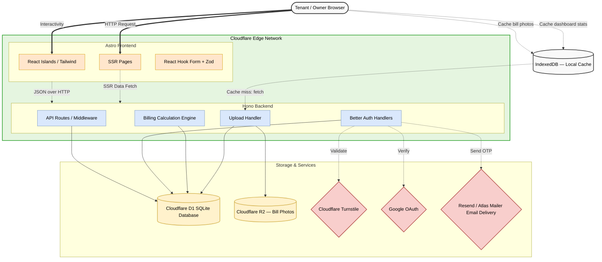
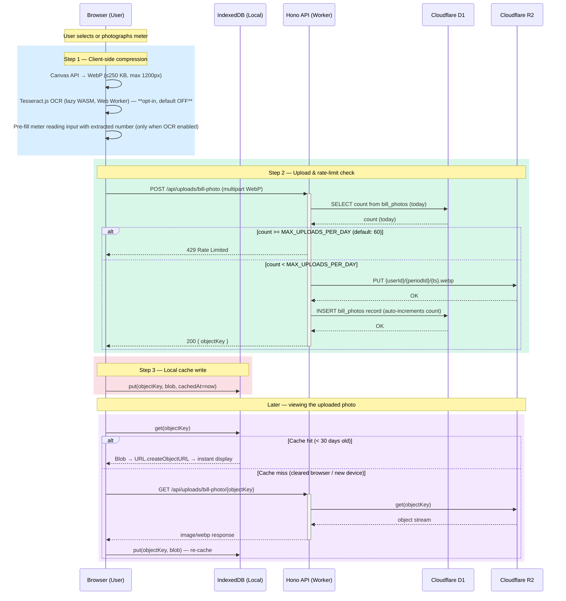
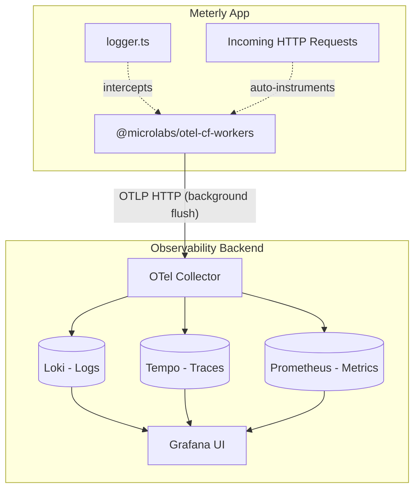

<p align="center">
  <picture>
    <source media="(prefers-color-scheme: dark)"
      srcset="https://shieldcn.dev/header/graph.svg?title=Meterly&subtitle=Transparent+utility+billing+for+solar+properties&logo=lightning&logoColor=ffffff&theme=emerald&mode=dark" />
    
  </picture>
</p>

<p align="center">
  <a href="https://github.com/VaibhavDaveDev/Meterly/stargazers">
    </a>
  <a href="https://github.com/VaibhavDaveDev/Meterly/blob/main/LICENSE">
    </a>
  <a href="https://github.com/VaibhavDaveDev/Meterly/actions/workflows/ci.yml">
    </a>
  <a href="https://github.com/VaibhavDaveDev/Meterly/commits/main">
    </a>
  <a href="https://meterly.pages.dev">
    </a>
  <a href="https://liberapay.com/VaibhavDaveDev/donate">
    </a>
</p>

# Meterly

Meterly is a transparent, multi-tenant utility billing platform designed to eliminate disputes between property owners and tenants. It handles complex utility scenarios, specifically properties equipped with grid-tied solar installations.

Traditional sub-metering leads to friction because calculations are opaque. Meterly fixes this with absolute mathematical transparency — tenants see the exact formula behind every bill: consumption rates, solar export refunds, and custom charges.

## Key Features

- **Dual-Mode Billing Engine** — supports both standard grid-only properties and solar-equipped properties with full export tracking
- **Absolute Transparency** — tenants see the complete breakdown of their bill, down to the last unit and applied rate
- **Audit Trails & Dispute Resolution** — built-in workflow for tenants to request meter reading corrections; owner approvals trigger an automated recalculation cascade
- **Solo Mode** — owners without tenants can track their own electricity usage with the same engine
- **Tenant Lifecycle Management** — invite, remove, and re-add tenants; past tenants retain access to historical bills for transparency until property deletion and tenant archival
- **DOX Documentation Framework** — structured AGENTS.md contract hierarchy maintaining strict architectural boundaries and developer instructions

## Tech Stack & Architecture

| Layer          | Technology                                                |
| -------------- | --------------------------------------------------------- |
| Frontend       | Astro (Islands), React, Tailwind CSS, shadcn/ui, Recharts |
| Backend        | Hono, Drizzle ORM                                         |
| Database       | Cloudflare D1 (SQLite)                                    |
| Auth           | Better Auth — email/password, Google OAuth, email OTP     |
| Bot Protection | Cloudflare Turnstile                                      |
| Deployment     | Cloudflare Pages & Workers                                |


```mermaid
graph TD
    %% Styling
    classDef client fill:#f9f9f9,stroke:#333,stroke-width:2px,color:#000;
    classDef edge fill:#e5f5e0,stroke:#2ca02c,stroke-width:2px,color:#000;
    classDef frontend fill:#ffe6cc,stroke:#d79b00,stroke-width:1px,color:#000;
    classDef backend fill:#dae8fc,stroke:#6c8ebf,stroke-width:1px,color:#000;
    classDef db fill:#fff2cc,stroke:#d6b656,stroke-width:2px,color:#000;
    classDef external fill:#f8cecc,stroke:#b85450,stroke-width:2px,color:#000;

    User([Tenant / Owner Browser])
    IDB[(IndexedDB — Local Cache)]

    subgraph Edge [Cloudflare Edge Network]
        direction TB

        subgraph UI [Astro Frontend]
            Pages[SSR Pages]
            Islands[React Islands / Tailwind]
            Forms[React Hook Form + Zod]
        end

        subgraph API [Hono Backend]
            Router[API Routes / Middleware]
            AuthHandler[Better Auth Handlers]
            Engine[Billing Calculation Engine]
            UploadHandler[Upload Handler]
        end

        UI -. JSON over HTTP .-> API
    end

    subgraph Data [Storage & Services]
        D1[(Cloudflare D1 SQLite Database)]
        R2[(Cloudflare R2 — Bill Photos)]
        Turnstile{Cloudflare Turnstile}
        GoogleOAuth{Google OAuth}
        Email{Resend / Atlas Mailer Email Delivery}
    end

    User == HTTP Request ==> Pages
    User == Interactivity ==> Islands

    Pages -. SSR Data Fetch .-> API

    Router --> D1
    AuthHandler --> D1
    Engine --> D1
    UploadHandler --> D1
    UploadHandler --> R2

    AuthHandler -. Validate .-> Turnstile
    AuthHandler -. Verify .-> GoogleOAuth
    AuthHandler -. Send OTP .-> Email

    User -. Cache bill photos .-> IDB
    User -. Cache dashboard stats .-> IDB
    IDB -. Cache miss: fetch .-> UploadHandler

    class User client;
    class IDB client;
    class Pages,Islands,Forms frontend;
    class Router,AuthHandler,Engine,UploadHandler backend;
    class D1,R2 db;
    class Turnstile,GoogleOAuth,Email external;
    class Edge edge;
```

## API Documentation

Meterly's API is documented with OpenAPI 3.0 via `@hono/zod-openapi`. Every route registered with `createRoute()` appears automatically — no separate JSON file to maintain.

- **Swagger UI:** `/api/docs` (development and production)
- **Raw spec:** `/api/docs/openapi.json`
- **Local:** `http://localhost:4321/api/docs`

## Bill Photo Upload Architecture

The upload flow keeps R2 costs minimal and gives users instant local access via IndexedDB.


```mermaid
sequenceDiagram
    participant U as Browser (User)
    participant IDB as IndexedDB (Local)
    participant W as Hono API (Worker)
    participant D1 as Cloudflare D1
    participant R2 as Cloudflare R2

    note over U: User selects or photographs meter

    rect rgba(0, 150, 255, 0.15)
        note over U: Step 1 — Client-side compression
        U->>U: Canvas API → WebP (≤250 KB, max 1200px)
        U->>U: Tesseract.js OCR (lazy WASM, Web Worker) — **opt-in, default OFF**
        U->>U: Pre-fill meter reading input with extracted number (only when OCR enabled)
    end

    rect rgba(0, 200, 100, 0.15)
        note over U,R2: Step 2 — Upload & rate-limit check
        U->>+W: POST /api/uploads/bill-photo (multipart WebP)
        W->>D1: SELECT count from bill_photos (today)
        D1-->>W: count (today)
        alt count >= MAX_UPLOADS_PER_DAY (default: 60)
            W-->>U: 429 Rate Limited
        else count < MAX_UPLOADS_PER_DAY
            W->>R2: PUT {userId}/{periodId}/{ts}.webp
            R2-->>W: OK
            W->>D1: INSERT bill_photos record (auto-increments count)
            D1-->>W: OK
            W-->>-U: 200 { objectKey }
        end
    end

    rect rgba(220, 50, 80, 0.15)
        note over U,IDB: Step 3 — Local cache write
        U->>IDB: put(objectKey, blob, cachedAt=now)
    end

    note over U,R2: Later — viewing the uploaded photo

    rect rgba(180, 100, 255, 0.15)
        U->>IDB: get(objectKey)
        alt Cache hit (< 30 days old)
            IDB-->>U: Blob → URL.createObjectURL → instant display
        else Cache miss (cleared browser / new device)
            U->>+W: GET /api/uploads/bill-photo/{objectKey}
            W->>R2: get(objectKey)
            R2-->>W: object stream
            W-->>-U: image/webp response
            U->>IDB: put(objectKey, blob) — re-cache
        end
    end
```

**Key design decisions:**

- Compression happens entirely in the browser — zero server CPU cost.
- OCR runs in a Web Worker so it never blocks the UI thread. It is opt-in and off by default.
- R2 object keys are prefixed with `{userId}/` — the API enforces this prefix on every read, so cross-user access returns 403.
- **Tenant billing history preservation & deferred sweep:** When an owner deletes a property, bill photos and billing records are **not** immediately deleted — they remain accessible as permanent tenant billing history. A deferred sweep (`sweepOrphanedPropertyData`) runs via `waitUntil` on owner delete and tenant archive routes. It permanently deletes R2 bill photos and associated DB history only after **both** conditions are met: the owner has deleted the property **and** every tenant has archived their tenancy. Until all parties have decommissioned their records, the sweep returns early with zero side effects.
- Upload rate-limiting queries existing database records from D1 daily, avoiding the Cloudflare KV write limit entirely.

## Observability

Meterly uses `@microlabs/otel-cf-workers` for edge-native observability — traces, logs, and metrics exported as OTLP from inside the Cloudflare Worker runtime.


```mermaid
graph TD
    subgraph App [Meterly App]
        Logger[logger.ts]
        Fetch[Incoming HTTP Requests]
        OTel["@microlabs/otel-cf-workers"]

        Logger -. intercepts .-> OTel
        Fetch -. auto-instruments .-> OTel
    end

    OTel -- "OTLP HTTP (background flush)" --> Collector[OTel Collector]

    subgraph ObservabilityBackend [Observability Backend]
        Collector --> Loki[(Loki - Logs)]
        Collector --> Tempo[(Tempo - Traces)]
        Collector --> Prom[(Prometheus - Metrics)]

        Loki --> Grafana[Grafana UI]
        Tempo --> Grafana
        Prom --> Grafana
    end
```

<details>
<summary>Local observability setup (Docker required)</summary>

```bash
# Start the observability stack
docker compose -f docker-compose.observability.yml up -d

# View collector logs
docker compose -f docker-compose.observability.yml logs -f otel-collector

# Stop (preserves data)
docker compose -f docker-compose.observability.yml stop

# Remove stack + delete all stored telemetry
docker compose -f docker-compose.observability.yml down -v
```

Add to `.dev.vars`:

```
OBSERVABILITY_ENABLED=true
OTEL_EXPORTER_OTLP_ENDPOINT=http://localhost:4318
LOG_LEVEL=info
```

Open Grafana at `http://localhost:3000` (admin / admin). Loki, Tempo, and Prometheus datasources are pre-provisioned.

For production (Grafana Cloud), set `OBSERVABILITY_ENABLED=true`, `OTEL_EXPORTER_OTLP_ENDPOINT`, and `GRAFANA_CLOUD_INSTANCE_ID` as plain Workers variables. Store `GRAFANA_CLOUD_API_KEY` as a Cloudflare **secret** (`wrangler secret put GRAFANA_CLOUD_API_KEY`) — never put API keys in plain Variables.

</details>

## Security

- **XSS Prevention** — React/Astro auto-escape output; no `dangerouslySetInnerHTML` usage
- **CSRF Protection** — Better Auth uses `SameSite=Lax/Strict` cookies
- **IDOR & Access Control** — every API route validates permissions via inline `isOwner` or `isTenant` checks (no CASL)
- **Rate Limiting** — auth endpoints rate-limited via Better Auth; bill photo uploads rate-limited per user per day
- **Bot Protection** — Cloudflare Turnstile on all auth routes

### Session Security

Meterly relies on Better Auth session cookies (`SameSite=Lax`, `HttpOnly`).

**Cloudflare deployment:** Cloudflare provides `CF-Connecting-IP` as the authoritative client IP header. The application uses only `CF-Connecting-IP` and ignores `X-Forwarded-For`, which Cloudflare may preserve or append to rather than strip. IP-spoofing attacks that forge `X-Forwarded-For` have no effect when deployed on Cloudflare and the application reads only `CF-Connecting-IP`.

**Rolling sessions:** Sessions auto-renew on activity. A session expires after 7 days of inactivity.

**Session limits:** Max 3 concurrent sessions per user (FIFO cleanup). A 4th login boots the oldest session.

**If migrating away from Cloudflare:** configure your reverse proxy to set `X-Real-IP`, read only that header in the Hono middleware (never `X-Forwarded-For`), store the client IP at session creation, compare on each request, and revoke on mismatch.

## Project Structure

This project uses the **DOX framework** — every domain directory has an `AGENTS.md` file that acts as a binding contract defining purpose, ownership, and architectural rules.

```
src/
├── api/          Hono backend routing and pure billing logic
├── components/   React interactive islands (auth, dashboard, properties, ui)
├── db/           Drizzle ORM schemas and migrations
├── layouts/      Astro server-rendered layouts
└── pages/        Astro SSR pages and API routing catch-alls
```

## Quick Start

1. Clone and install:
   ```bash
   git clone https://github.com/VaibhavDaveDev/Meterly.git
   cd Meterly && pnpm install
   ```
2. Copy environment file: `cp .env.example .dev.vars`
3. Create a D1 database: `pnpm exec wrangler d1 create meterly-db`, then paste the `database_id` into `wrangler.jsonc`
4. Apply schema: `pnpm exec wrangler d1 execute meterly-db --local --file=./src/db/migrations/0000_init.sql`
5. Start dev server: `pnpm run dev` — app is at `http://localhost:4321`

OTP codes for sign-up and password reset print directly to your terminal in development — no mailer needed.

For full local setup, migrations, seeding, and contributor workflow see [CONTRIBUTING.md](CONTRIBUTING.md).

For production deployment see [DEPLOY.md](DEPLOY.md).

## License

[AGPL-3.0](LICENSE)
